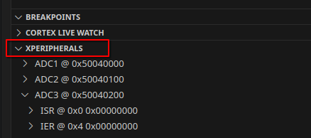

# Zig Meets C: Cross-Language Development for Embedded Microcontrollers

- [Zig Meets C: Cross-Language Development for Embedded Microcontrollers](#zig-meets-c-cross-language-development-for-embedded-microcontrollers)
  - [Description](#description)
  - [Embedded related progress](#embedded-related-progress)
  - [Examples List](#examples-list)
  - [Build](#build)
  - [Installation](#installation)
    - [Linux](#linux)
    - [Windows](#windows)
    - [Vs Code / Vs Codium](#vs-code--vs-codium)
    - [Containers (Podman or Docker)](#containers-podman-or-docker)
      - [Podman Compatibility (Linux)](#podman-compatibility-linux)
  - [SVD Files](#svd-files)
  - [Testing and CI](#testing-and-ci)
    - [Running Tests with the Repository Container](#running-tests-with-the-repository-container)
    - [Testing GitHub Workflows Locally with Act](#testing-github-workflows-locally-with-act)
      - [Using Act with Podman on Linux](#using-act-with-podman-on-linux)
  - [Clang tooling](#clang-tooling)
    - [Style and formatting](#style-and-formatting)
  - [Resources](#resources)


## Description

[Zig](https://ziglang.org/) is a language that seems perfect for embedded systems programming, and you might be considering incorporating Zig code into your embedded development projects. However, there are several reasons why you might not want just to start a project with it.

- You use a manufacturer-specific software generator (e.g., STM32CubeMX) to simplify device initialization and peripheral configuration. The generated code is in C.
- The project already exists, and rewriting it is not an option.
- Your future project rely heavily on C-based components, such as operating systems (e.g., FreeRTOS), filesystems (e.g., LittleFS), libraries, drivers, etc. You don’t want to rewrite initialization or configuration routines that already work well and are widely used elsewhere.
- You work with coworkers who will maintain, update, and/or test parts of the project's C code. They may not use Zig—either not yet or never.

This repository explores the integration of Zig into microcontroller development projects that are already written in C, covering both bare-metal and OS-based environments. It provides practical examples, tutorials, and tools to help developers combine the power of Zig's modern features with the established C ecosystem.

This is a work in progress, and help is welcome to add more examples, improve documentation, or provide corrections.

## Embedded related progress

| Issue                                                 | Summarry                                                                                                                                           |
| :---------------------------------------------------- | :------------------------------------------------------------------------------------------------------------------------------------------------- |
| [#23111](https://github.com/ziglang/zig/issues/23111) | Regression with finding linker scripts during cross-compilation                                                                                    |
| [#17365](https://github.com/ziglang/zig/issues/17365) | JSON Compilation Database Generation used with many C tools (e.g., linters, LSPs, IDE,etc.)                                                        |
| [#20327](https://github.com/ziglang/zig/issues/20327) | LibC interface in build.zig User custom integration ? newlib, picolibc, musl ?                                                                     |
| [#9844](https://github.com/ziglang/zig/issues/9844)   | LTO cause startup functions, vector_table to be dropped. New [linker](https://ziglang.org/download/0.16.0/release-notes.html#Linker) to solve it ? |
| [#25653](https://github.com/ziglang/zig/issues/25653) | There's currently some bugs with Zig's implementation of objcopy                                                                                   |

* [Translate-C](https://codeberg.org/ziglang/translate-c/issues) command has difficulty translating some C declarations and macros found in Embedded Drivers or CMSIS files. (Work in Progress)
* `Debug` Release mode without `-Og` optimization level can make binary too huge to fit in a device. However, the Clang documentation says `-Og Like -O1. In future versions, this option might disable different optimizations in order to improve debuggability.`, which could imply that the debugging experience may be less effective than with GCC.

## Examples List

The examples are built for a specific target. However, the documentation will try to explain enough about what Zig implies to change in an example so that you can figure out what you need to change when applying it to other targets (with more or less difficulty).

```
projects/
├── stm32f407g-disc1
│   └── blinky
└── stm32l476_nucleo
    ├── blinky
    ├── blinky_freertos
    ├── blinky_picolibc
    └── juicy_hello_world_cmake
```

## Build

All projects use the [Zig Build System](https://ziglang.org/learn/build-system/).  
Check the `README.md` of an project example for additional specific information.

## Installation

List of tools that is used around examples

| Name              | Version   | Description                                                             |
| :---------------- | --------- | :---------------------------------------------------------------------- |
| Zig               | `0.16.0`  | For compiling C and Zig code                                            |
| ZLS               | `0.16.0`  | Language Server Protocol for Zig                                        |
| Arm GNU Toolchain | `15.2.1`  | Tools for C development (gdb, binutils) and libc                        |
| LLVM+Clang        | `21.1.8`  | Tools for C development (clang-format, clang-tidy, clangd)              |
| ST link           | `v1.8.0`  | For flashing firmware                                                   |
| OpenOCD           | `v0.12.0` | Provides debugging and flashing capabilities.                           |
| STM32CubeMX       | `6.17`    | For the generation of the corresponding initialization C code for STM32 |
| Act               | `v0.2.86` | Run GitHub CI locally                                                   |
| CMake             | >= `3.22` | A Software Build System                                                 |

### Linux

```bash
#Fedora
yum install curl stlink openocd clang-tools-extra clang
#Debian
apt install xz-utils curl stlink-tools openocd clang-tools clang-tidy clang-format
    
#Create tools folder
mkdir -vp /opt/tools

#Install gcc-arm-none-eabi (https://developer.arm.com/downloads/-/arm-gnu-toolchain-downloads)
GCC_VERSION="15.2.rel1"
curl -L -o gcc-arm-none-eabi.tar.xz https://developer.arm.com/-/media/Files/downloads/gnu/${GCC_VERSION}/binrel/arm-gnu-toolchain-${GCC_VERSION}-x86_64-arm-none-eabi.tar.xz \
    && mkdir -vp /opt/tools/gcc-arm-none-eabi \
    && tar xf gcc-arm-none-eabi.tar.xz -C /opt/tools/gcc-arm-none-eabi \
    && ln -vs /opt/tools/gcc-arm-none-eabi/bin/*  ~/.local/bin \
    && rm gcc-arm-none-eabi.tar.xz

#Install Zig
ZIG_VERSION="0.16.0"
curl -L -o zig.tar.xz https://ziglang.org/download/${ZIG_VERSION}/zig-x86_64-linux-${ZIG_VERSION}.tar.xz \
    && mkdir -vp /opt/tools/ \
    && tar -xf zig.tar.xz -C /opt/tools/ \
    && ln -vs /opt/tools/zig-x86_64-linux-*/zig ~/.local/bin \
    && rm zig.tar.xz

#Install ZLS
ZLS_VERSION="0.16.0"
curl -L -o zls.tar.xz https://github.com/zigtools/zls/releases/download/${ZLS_VERSION}/zls-x86_64-linux.tar.xz \
    && mkdir -vp /opt/tools/ \
    && tar -xf zls.tar.xz -C /opt/tools/zls-x86_64-linux \
    && ln -vs /opt/tools/zls-x86_64-linux/zls ~/.local/bin \
    && rm zls.tar.xz
```

### Windows

For Windows users,  Information available in this [document](docs/windows.md) to setup your environnement.

### Vs Code / Vs Codium

For Vs Code users, Information available in this [document](docs/vscode.md) for configurations

### Containers (Podman or Docker)

Instead of installing the various tools in your system, you can use containers to build or flash the firmware.
Two technologies exist, both CLI APIs are mostly compatible: **Docker** and **Podman**. I use `podman` for my examples, but you can simply replace it with `docker` if you prefer.

```bash
#Create the image
docker build -f ContainerFile --tag=zig_and_c:0.16.0 .
#Run a container
docker run --rm -it --privileged -v ./:/workspace --name=zig_and_c zig_and_c:0.16.0
# Navigate to a project (example blinky)
cd projects/stm32l476_nucleo/blinky
# Build the firmware
zig build
```

Remove dangling image if needed `podman image prune`

#### Podman Compatibility (Linux)

You can create a wrapper script and place it in binary directory that’s in your `PATH` to make `docker` commands work with Podman:

```bash
#!/bin/bash
export DOCKER_HOST=unix://$XDG_RUNTIME_DIR/podman/podman.sock
podman "$@"
```

``` bash
# If you need full daemon compatibility, make sure the Podman socket is enabled and started:
systemctl --user enable --now podman.socket
# Enable linger if podman service run with a server
loginctl enable-linger $(whoami)
```

## SVD Files

The CMSIS System View Description format(CMSIS-SVD) formalizes the description of the system contained in Arm Cortex-M processor-based microcontrollers, in particular, the memory mapped registers of peripherals.

- You can use [regz](https://github.com/ZigEmbeddedGroup/microzig/tree/main/tools/regz) to generate `registers` code in Zig.
- You can use it with VS Code in debugging mode.



You can found stm32 SVD files in this [Github repository](https://github.com/modm-io/cmsis-svd-stm32)

## Testing and CI

### Running Tests with the Repository Container

To execute tests using the project's container image:

```bash
# Run tests in the container
docker run --rm -it --privileged -v ./:/workspace --name=zig_and_c zig_and_c:0.16.0 sh ci/build-examples.sh
```

### Testing GitHub Workflows Locally with Act

You can test GitHub workflow modifications locally using [act](https://github.com/nektos/act).

```bash
# Display workflow graph
act --graph
# Run workflows locally
act
```

#### Using Act with Podman on Linux

To configure Act to use Podman instead of Docker, see [Podman Compatibility (Linux)](#podman-compatibility-linux)

## Clang tooling

For C/C++ development, projects leverages Clang-based tooling, with configurations defined in:  
- **`.clang-format`** (code style formatting)  
- **`.clang-tidy`** (static analysis and linting)  
- **`.clangd`** (IDE smart features like autocompletion and diagnostics)  

### Style and formatting

1. Generated from: `clang-format --style=llvm --dump-config > .clang-format`
2. Parameters to change to correspond to Zig formatting:

```
SortIncludes:    false
IndentWidth:     4
ColumnLimit:     120
AllowShortFunctionsOnASingleLine: None
```

- Example: Command to format all C source files.

```bash
find ./ -name '*.c' -o  -name '*.h'| xargs clang-format -style=file -i --verbose
```

## Resources

- [Zig Guide: working with C](https://zig.guide/working-with-c/abi/) A Guide to learn the Zig Programming Language
- [Ziggit](https://ziggit.dev/) A community for anyone interested in the Zig Programming Language.
- [STM32 Guide](https://github.com/haydenridd/stm32-zig-porting-guide) will help you to understand and port your current project with different level of Zig integration. [Ziggit topic](https://ziggit.dev/t/stm32-porting-guide-first-pass/4414).
- [Zig Embedded Group](https://github.com/ZigEmbeddedGroup) A group of people dedicated to improve the Zig Embedded Experience
- [All Your Codebase](https://github.com/allyourcodebase) is an organization that package C/C++ projects for the Zig build system so that you can reliably compile (and cross-compile!) them with ease.
- [Awesome Zig](https://github.com/zigcc/awesome-zig?tab=readme-ov-file) This repository lists "awesome" projects written in Zig, maintained by ZigCC community.
