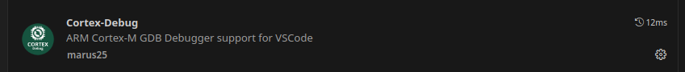

# VS code Users

## Description

For VS Code users, each project includes a **`.vscode`** folder containing:  
- **`launch.json`** – Debugging configurations  
- **`tasks.json`** – Build and firmware upload tasks  

## Settings

```json
{
    "clangd.path": "clangd",
    "clangd.arguments": [
        "--query-driver=/opt/bin/arm-none-eabi-gcc",
        "--header-insertion=never",
        "--enable-config",
        "-j=8"
    ],
    "[c]": {
        "editor.defaultFormatter": "ebextensions.clang-format-2025"
    },
    "[cpp]": {
        "editor.defaultFormatter": "ebextensions.clang-format-2025"
    },
}
```

## Extensions

- **`llvm-vs-code-extensions.vscode-clangd`** – A Clangd-based language server for C/C++ with code navigation, linting, and smart completion.

- **`ebextensions.clang-format-2025`** – For code formatting (preferred over clangd to support `.clang-format-ignore` files).  

- **`marus25.cortex-debug`** for debugging ARM Cortex-M targets.



- **`actboy168.tasks`** to got quick shortcut of your tasks in your status bar

