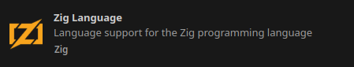
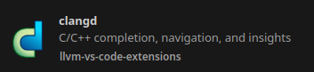
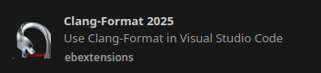
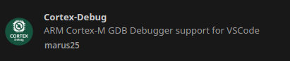

# VS code Users

For VS Code users, each project includes a **`.vscode`** folder containing:  
- **`launch.json`** – Debugging configurations  
- **`tasks.json`** – Build and firmware upload tasks  

For C/C++ development, projects use Clang-based tooling instead of `C/C++ IntelliSense`. This makes it easier to switch to other IDEs or editors. You can use the two extensions `llvm-vs-code-extensions.vscode-clangd` and `ebextensions.clang-format-2025`
We use the latter for formatting (instead of `clangd`) because `clangd` ignores `.clang-format-ignore` files.  

## Extensions

- **`ziglang.vscode-zig`** to get Zig support



- **`llvm-vs-code-extensions.vscode-clangd`** – A Clangd-based language server for C/C++ with code navigation, linting, and smart completion.



- **`ebextensions.clang-format-2025`** – For code formatting (preferred over clangd to support `.clang-format-ignore` files).  



- **`marus25.cortex-debug`** for debugging ARM Cortex-M targets.



- **`actboy168.tasks`** to got quick shortcut of your tasks in your status bar


Usage:


## Settings

Configuration example

```json
{
    "zig.path": "zig",
    "zig.zls.enabled": "on",
    "clangd.path": "clangd",
    "clangd.arguments": [
        "--query-driver=/opt/bin/arm-none-eabi-gcc",
        "--header-insertion=never",
        "--enable-config",
        "-j=8"
    ],
    "[c]": {
        "editor.defaultFormatter": "ebextensions.clang-format-2025"
    },
    "[cpp]": {
        "editor.defaultFormatter": "ebextensions.clang-format-2025"
    },
}
```

__Notes__

- The option `--query-driver` need a complete path, the example above was for linux. For windows use `C:\tools\xpack-arm-none-eabi-gcc-14.2.1-1.1\bin\arm-none-eabi-gcc`
- JSON Compilation Database is needed but not ready, See the `README.md`