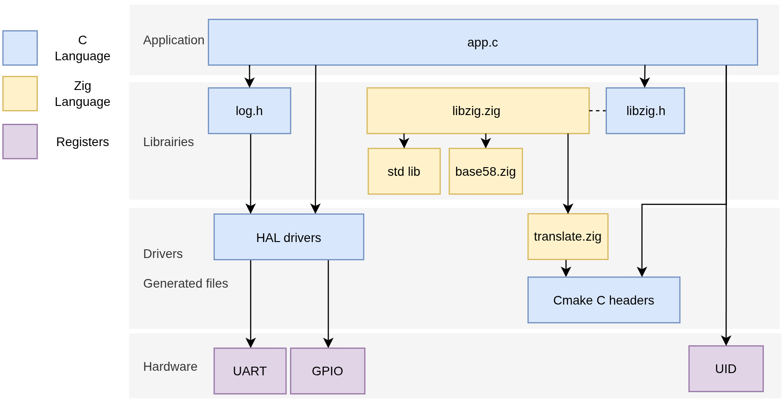

## juicy_hello_world_cmake

The goal of this example is to show how to integrate Zig into a CMake-based build system.
The program starts in `Core/Src/main.c` at `int main(void)`, initializes the hardware, then calls the function `void app_entrypoint(void)` located in `src/app/app.c`.
The example prints information over UART, then continues in a loop by blinking the LED.
  
A custom CMake module file, **`zig-module.cmake`**, adds an `add_zig_module` function that appears reasonably functional for incorporating Zig code into a CMake-based project and relies on `zig build-obj` and optional `zig translate-c`. `zig-module.cmake` automatically consumes CMake target properties to pass arguments to `zig translate-c`.

### Layered architecture dependencies

<div style="text-align: center;">

</div>

### CMake / Zig Tree Description

```bash
./
├── CMakeLists.txt     # Main CMake script
└── CMakePresets.json  # CMake preset configurations

./src/zig/
├── base58.zig     # Base58 encoding/decoding library
├── libzig.h       # C interface (manually written, -femit-h not available)
├── libzig.zig     # Zig library (encoding/hashing functions)
├── translate.h    # C headers to be translated and used with libzig
└── translate.zig  # Generated by zig translate-c via a CMake command

./cmake/
├── cmake_config.h.in       # CMake input configuration: project name, build type
├── cmake_version.h.in      # CMake template for Git version information (multiple formats)
├── gcc-arm-none-eabi.cmake # Toolchain file (used with presets)
├── generate-version.cmake  # CMake script to retrieve Git information
├── stm32cubemx             # Generated by STM32CubeMX (HAL drivers / middleware)
│   └── CMakeLists.txt
└── zig-module.cmake        # Zig module integration (zig translate-c and zig build-obj)
```

### Zig integration

To include the Zig code, `add_zig_module` is called from `CMakeLists.txt`:

```cmake
include(${CMAKE_SOURCE_DIR}/cmake/zig-module.cmake)

add_zig_module(
    NAME libzig
    LINK_TO ${CMAKE_PROJECT_NAME}
    SRC_ROOT ${CMAKE_SOURCE_DIR}/src/zig/libzig.zig
    TARGET
        -target thumb-freestanding-eabihf
        -mcpu=cortex_m4+vfp4d16sp+dsp
        -fsingle-threaded

    # Optionnal C translation and dependencies
    TRANSLATE_IN ${CMAKE_SOURCE_DIR}/src/zig/translate.h
    TRANSLATE_OUT ${CMAKE_SOURCE_DIR}/src/zig/translate.zig
    TRANSLATE_DEPENDS
        ${CMAKE_BINARY_DIR}/cmake_config.h
        ${CMAKE_BINARY_DIR}/cmake_version.h

    BUILD_OPTS
        # Optional zig build-obj flags
)
```

### Program output

Before blinking indefinitely, the program prints various system and build information. Below is an example output with comments indicating the origin of each field:

```bash
 Project:      juicy_hello_world_cmake  # CMake project name (cmake_config.h)
 Project Hash: 5f8973e5                 # Zig compile-time hash of the project name
 Commit:       bc73359d                 # Generated by CMake (cmake_version.h)
 Git:          0.15.2-3-gbc73359d       # Generated by CMake (cmake_version.h)
 Compiler:     15.2.1 20251203          # Compiler macro (__VERSION__, GCC in this case)
 Build type:   Debug                    # Generated by CMake (cmake_config.h)
 S.N (96b):    002400534B42500620343431 # MCU register serial number (96-bit)
 S.N (64b):    96F812E66482CDE6         # Zig runtime hash of the 96-bit serial number
 S.N (b58):    "fc5QeAX8CHK"            # Zig runtime Base58 encoding of the 64-bit value

 Hello world !
```

### Zig error type with C

In this example, a utility function is used to translate Zig errors into negative `int` values, which can then be used from C code. These values can be passed to a function such as `zig_error_to_string` to print the corresponding error message. This includes all errors defined in the Zig library.

**Warning:** this is not a safe function. Passing a value that is not a valid Zig error code leads to undefined behavior.

```zig
// libzig.zig error set
pub const Error = error{
    InputNoData,
    BufferEmpty,
};
```

```bash
 Build type:   Debug
 S.N (96b):    002400534B42500620343431
 Error when encoding: BufferEmpty (-6) # Zig error printed from C application (NULL was passed to the encoding function)

 Hello world !
```

